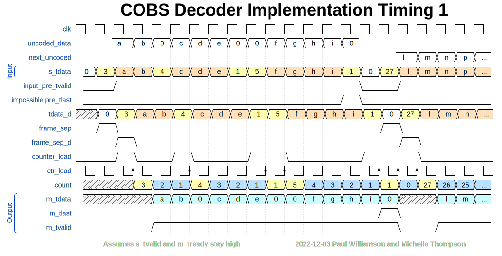
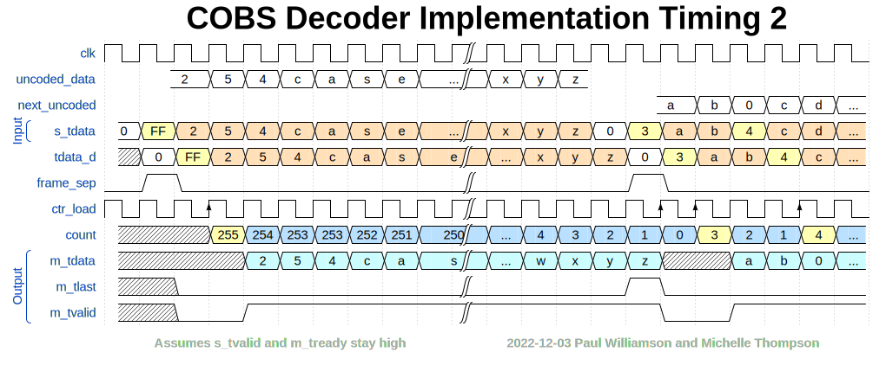
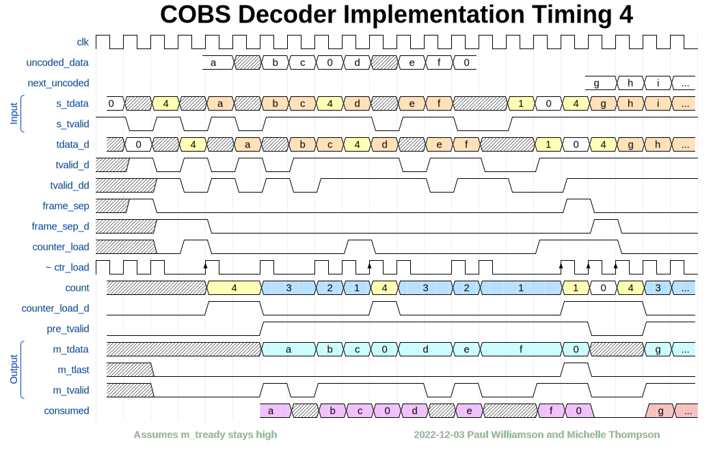
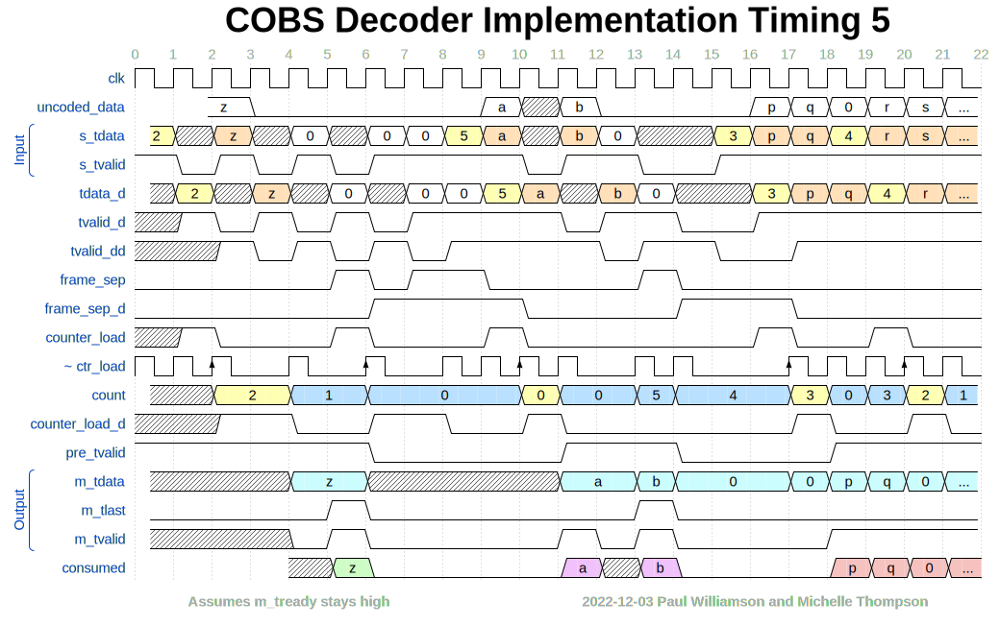
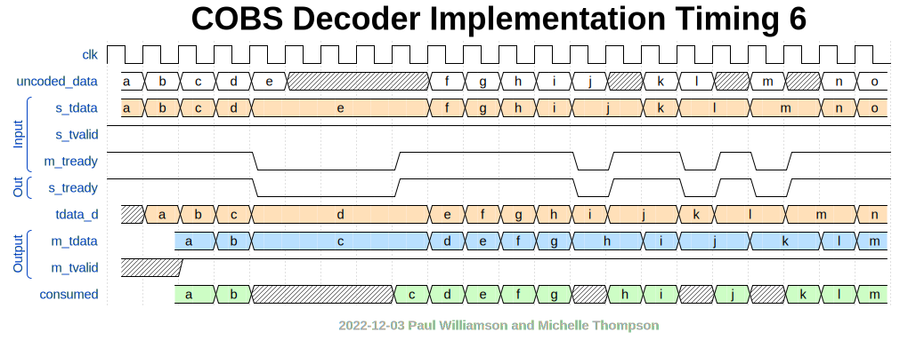

# Design of an AXI-S COBS Decoder Implementation in VHDL

## Entity Inputs and Outputs
### Entity Inputs
Aside from the usual `clk` and `rst` signals, the only input to the entity is an AXI-Stream with a width of one byte. The data stream consists of frames encoded according to the rules described in [Consistent Overhead Byte Stuffing](http://www.stuartcheshire.org/papers/cobsforton.pdf) by Stuart Cheshire and Mary Baker. These rules convert a known-length stream of bytes (a "frame") with all values 0-255 into a slightly longer stream of bytes containing only values 1-255, allowing a byte with value 0 to be used unambiguously as a separator. It does this by dividing the stream into sequences of bytes. Each sequence must consist of zero to 253 non-zero bytes followed by a 0 byte or the end of stream, or 254 non-zero bytes. It is then encoded as the sequence length (1 to 254) followed by the non-zero bytes.

Because the input is an AXI stream, it does not necessarily arrive continuously, with one byte delivered every clock cycle. The handshaking signals `s_tvalid` and `s_tready` take care of this. The data source asserts `s_tvalid` only when it has a valid byte available on its output (and may not deassert it or change the data until that byte has been transferred). This entity only asserts `s_tready` when it is ready to accept a data byte. When both signals are asserted at a rising edge of `clk`, and only then, a byte is transferred into the entity from the data source.

The input AXI stream has the ability to indicate that a certain byte is the last byte of the transfer by asserting `s_tlast`. This information is to be ignored by this entity, which treats the input as an undifferentiated stream of bytes and divides it up based solely on the data values within the stream.

Coded frames are separated by zero bytes. Ideally, exactly one zero byte at the beginning and exactly one zero byte after each frame. The entity must also deal with multiple zero bytes in any of those positions, without generating any extra output.

Additional signals defined for AXI streams include `s_tuser` and `s_tid`. These are defined to be valid only on the first byte of an AXI transfer. Since we are ignoring the boundaries of AXI transfers, we will also ignore these signals.

### Entity Outputs
The only output from the entity is an AXI-Stream with a width of one byte. This data stream consists of the data decoded according to the COBS rules. The AXI signal `m_tlast` is asserted along with the last byte of each frame. The zero separators are not passed along.

Because the output is an AXI stream, it cannot necessarily be sent out continuously, with one byte delivered every clock cycle. The handshaking signals `m_tvalid` and `m_tready` take care of this. This entity asserts `m_tvalid` only when it has a valid byte available on its output (and may not deassert it or change the data until that byte has been transferred). The data consumer only asserts `m_tready` when it is ready to accept a data byte. When both signals are asserted at a rising edge of `clk`, and only then, a byte is transferred from the entity to the data consumer. It is the responsibility of this entity to manage its `s_tready` based on its `m_tready` so that data flows through correctly.

## Timing Design
### Required Baseline Clock Delays

In some AXI-S designs, the data can flow through without any delay. That's not possible in this entity. This timing diagram illustrates why:

Here we see an encoded sequence starting with a count of 3 and two non-zero data bytes, labeled 'a' and 'b'. In COBS encoding, this usually represents a three-byte sequence, consisting of the values of 'a' and 'b' followed by a zero byte. However, if this encoded sequence occurs at the end of the frame, it represents a two-byte sequence, with no trailing zero byte added. The value of the byte marked with a question mark determines which. If that byte is 0, it is a frame separator and the sequence is only two bytes long. If that byte is any other value, it is not a frame separator, and the sequence is three bytes long.

We see the entity's output signals drawn at three different delays. In each case, the signals `m_tlast` and `m_tvalid` are shown ambiguously. `m_tlast` is always one clock cycle wide, but might appear in either location shown. It must appear in the early location if the '?' byte is a 0, and in the later location if the '?' byte is non-zero. Likewise, `m_tvalid` is either two or three clock cycles wide.

Look first at the case with zero delay. If the '?' byte is a zero, we need to assert `m_tlast` at clock edge 3, but we don't get a look at the '?' byte until after clock edge 4. This is clearly impossible.

Look next at the case with one cycle of delay. Now the earliest output is just after clock edge 4. This is possible, but only if we use the value of the input `s_tdata` combinatorially to create all of the output signals. This is probably feasible, but could result in more difficult timing constraints and is likely to create glitches on the output signals.

In the case with two cycles of delay, we can sample the '?' byte on clock edge 5, and use that data synchronously to derive the output signals. This seems safer and cleaner.

We will take two cycles of delay as our design baseline. Actual delays with handshaking taken into account will be longer if our data supplier or data consumer are not both ready to transfer data on every cycle.

### Counting Bytes in Each Sequence

We'll need to take special note of the input bytes that provide the length of a coded sequence, and count this value down as the remaining bytes of the sequence arrive. We'll call this value `count` and denote the counter load events as rising edges on the pseudo-signal `ctr_load` (actually we'll make a real signal `counter_load` and load `count` on a rising edge of `clk` when `counter_load` is high).

### Timing Diagram 1 Walkthrough

For now, let's ignore the handshaking requirements and assume that `s_tvalid` and `m_tready` (our handshaking inputs) are always high. This is the full-speed case with no extra delays.

The timing diagram below shows an example of this case. We see the entirety of one short frame, and the immediate beginning of a second frame. The first frame contains 13 bytes, as shown on the line marked `uncoded_data`. The second frame contains 27 bytes or more, and the beginning of this frame is shown on the line marked `next_uncoded`.

The signal `s_tdata` shows the encoded data stream at the input to the entity. With no handshaking, these bytes arrive a full speed, one per clock cycle. The white 0 bytes are the frame separators. The yellow bytes are the sequence length bytes. The orange bytes are the non-zero data bytes within each sequence.

See that the first frame is encoded as five sequences:
  1. a b 0, length = 3
  2. c d e 0, length = 4
  3. 0, length = 1
  4. f g h i 0, length = 5
  5. 0, length = 1

That's 14 total. The extra 0 at the end is not really part of the frame. It's an artifact of the COBS encoding.

We can't see all of the second frame, but we do see the beginning of its first sequence.
  1. l m n p ... 0, length = 27

The next two lines of the timing diagram show pseudo-signals that do not actually exist in the design. `input_pre_tvalid` is the value we'd assign to our `m_tvalid` if we were passing through the data without delay: it spans the bytes in `s_tdata` that we would be passing through. Likewise, `impossible pre_tlast` is the value we'd assign to our `m_tlast` with no delay. This is *impossible* because its value depends on the white 0 in `s_tdata` that occurs on the *following* clock cycle. This is why we have to delay the data.

The next line shows the input data delayed by one cycle, `tdata_d`. We can start drafting the logic equations for the decoder, shown in the gray box below. Some of these logic equations may be unfinished, and will be shown again with more refinement later in this document.

    on rising edge of clk, tdata_d <= s_tdata

The next two lines show the detection and delay of a zero byte in the input. When a non-zero byte follows a zero byte, that's the frame length byte at the beginning of the first sequence of a frame.

    frame_sep = 1 when tdata_d == 0, otherwise 0

    on rising edge of clk, frame_sep_d <= frame_sep

The next line shows the combinational signal `counter_load`. The counter loads on the clock edge at the end of each `tdata_d` byte containing a sequence length. We also show this as a pseudo-signal `ctr_load`, which is a copy of `clk` with arrows added where the counter will be loaded, just for visual clarity in the diagram.

    counter_load = '1' when (tdata_d != 0 and frame_sep_d == 1) or count == 1, else '0' 

The next line shows `count`. It loads with the sequence length on the `ctr_load` edges. On other clock edges, it counts down. When it reaches 1, it will be time to insert the 0 that's (usually) at the end of each short sequence. This 0 takes the place of the sequence count for the next sequence, if there is one, or otherwise the 0 separator at the end of the frame. It will also be time for another `ctr_load` edge, if there is one, to capture that new sequence length in `count`. If it also loads `count` with the 0 separator, that's harmless, because the first byte *after* the 0 separator is also time for a `ctr_load` edge, which will overwrite `count` with the next sequence length.

    on the rising edge of clk,
    
      if counter_load is high, count <= tdata_d
      elsif count != 0, count <= count - 1

The next line shows our data output, `m_tdata`. Those data bytes sent literally in `s_tdata` are copied from `tdata_d` into `m_tdata`, with one further cycle of delay. Each sequence length byte sent is replaced in `m_tdata` with a 0, which is the final 0 of the preceding sequence. The sequences in this diagram are all short (not 254 bytes long), so they all include a final 0 per the COBS protocol, unless they occur at the end of a frame.

    on the rising edge of clk,
      if counter_load is high, m_tdata <= 0
      else m_tdata <= data_d

In between frames, we have a gap of two clock cycles on the output. One cycle is the minimum COBS coding overhead. The other cycle is the frame separator. This is the best we can possibly do.

The next line shows the `m_tlast` signal. It is high for the duration of the last byte in the frame. In this case, that happens to be the implied 0 at the end of the fourth sequence.

    m_tlast = frame_sep

The next line shows the `m_tvalid` signal. This signal is high whenever valid data bytes are on `m_tdata`. This goes high three cycles after the preceding frame separator 0 byte in `s_tdata`, and goes low one cycle after the following frame separator 0 byte in `s_tdata`.

    on the rising edge of clk,
      frame_sep_dd <= frame_sep_d
      m_tvalid goes high if frame_sep_dd is high
      m_tvalid goes low if frame_sep is high

Again, note that some of the logic equations in the gray boxes are incomplete for now.

### Timing Diagram 2 Walkthrough

We will continue to ignore the handshaking requirements and assume that `s_tvalid` and `m_tready` (our handshaking inputs) are always high.

The timing diagram below shows a first frame consisting of 254 data bytes, none of which are 0. Some of the bytes in the middle of this frame are omitted to save space in the diagram. The last bytes in the frame are shown as v, w, x, y, z. The diagram also shows the beginning of the next frame, which starts with a three-byte sequence followed by a four-byte sequence, which falls off the right edge of the diagram.

This is very much like the case shown in the first diagram, except that the 254-byte sequence does not include a 0 at the end. All 254 bytes are sent literally in the input data. The pseudo-length 255 is used to indicate this special case, per the COBS protocol.

In this example, though, we don't really have to worry about the special case, because the end of the long sequence is also the end of the frame. Later we will see that this special case does have to be handled specially when the 254-byte sequence does not fall at the end of a frame.

### Timing Diagram 3 Walkthrough

We will continue to ignore the handshaking requirements and assume that `s_tvalid` and `m_tready` (our handshaking inputs) are always high.

The timing diagram below shows a first frame consisting of 257 data bytes, none of which are 0. Some of the bytes in the middle of this frame are omitted to save space in the diagram. This is encoded as two sequences. The first sequence is the same as before, a sequence of 254 non-zero bytes encoded with a pseudo-length of 255. The second sequence is encoded as if it included an extra 0 at the end, so it has a length of 4 even though only 3 actual bytes are encoded. The decoder is expected to trim off that trailing 0, per the COBS protocol.

The diagram also shows the beginning of the next frame, which starts with a four-byte sequence, which falls off the right edge of the diagram.

Because the first sequence does not include a zero at the end, the decoder output must skip a clock cycle to stay aligned two cycles behind the input. This is no problem: we just drop m_tvalid for that clock cycle, which causes the data consumer to wait. It doesn't matter what we present on `m_tdata` during that cycle.

In order to implement this special case, we create a new signal called `case_255`. It is set when we load `count` with a length of 255, and cleared when we load any other length. Then we know to deassert `m_tvalid` when `count` equals 1 and `case_255` is high. We also need to reassert `m_tvalid` one cycle later.

    on rising edge of clk,
      if counter_load is high and tdata_d == 255, case_255 goes high
      elsif counter_load is high, case_255 goes low

      counter_load_d <= counter_load

      m_tvalid goes low if frame_sep is high
      m_tvalid goes low if counter_load is high and case_255 is high
      m_tvalid goes high if counter_load_d is high

### Timing Diagram 4 Walkthrough

Now we will begin to introduce the complexity of handling the AXI-S handshaking signals. This timing diagram shows several cases where the `s_tvalid` signal from the data source goes low.

The input data consists of two frames. The first frame has eight bytes, coded as two sequences of three-nonzero bytes followed by a zero. The next frame starts the same way, and runs off the right edge of the diagram.

We have shown the data source inserting delays after the frame separator 0 byte, after the first sequence length, after the first data byte of each sequence, and after the last non-zero byte of the second sequence.

The rising edges of `clk` that occur with `s_tvalid` low need to be ignored. This is shown with skipped cycles on the pseudo-clock labeled `ctr_load`.

We create a delayed version of `s_tvalid` called `tvalid_d` to help with this, and update the rules:

    on rising edge of clk,
      tvalid_d <= s_tvalid
      if tvalid_d is high,
        frame_sep_d <= frame_sep
        if counter_load is high, count <= tdata_d
        elsif count != 0, count <= count - 1

    counter_load = '1' when (tdata_d != 0 and frame_sep_d == 1 and tvalid_d == 1) or (count == 1 and tvalid_d == 1), else '0' 

The `m_tvalid` output signal, however, cannot simply ignore those clock edges. It needs to reflect the delays, but can be high for only one cycle per byte transferred, so that the data consumer will accept each byte exactly once. We create a signal `pre_tvalid` that is like `m_tvalid` but ignores `s_tvalid`. Then we punch out the cycles corresponding to those cycles when `s_tvalid` was low. This requires a version of `tvalid_d` delayed by a further one `clk` cycle, `tvalid_dd`.

It's not important what data is on `m_tdata` when `m_tvalid` is low, so we can allow `m_tdata` to ignore the clock edges when `s_tvalid` is low, as shown.

So, the improved rule for `m_tvalid` is as follows:

    on the rising edge of clk,
      tvalid_dd <= tvalid_d
      if tvalid_d is high,
        counter_load_d <= counter_load
        pre_tvalid goes high if counter_load_d is high

      pre_tvalid goes low if frame_sep is high
      pre_tvalid goes low if counter_load is high and case_255 is high

    m_tvalid is pre_tvalid and tvalid_dd

We're still assuming `m_tready` is staying high, so this rule still isn't final!

### Timing Diagram 5 Walkthrough

Before we go on with handshaking, let's talk about frame separators. The paper implies that frame separators can only occur between sequences, and only one at a time. That's great for the encoder, but this entity is a decoder and needs to handle unexpected frame separators (zero bytes).

If we see multiple consecutive frame separators, that would seem to imply zero-length frames in between them. AXI-S has no concept of zero-length frames, though, so the best we can do is treat the whole run of consecutive frame separators as a single frame separator.

If we see a frame separator arrive during the data part of a sequence, something has gone wrong. The best we can do is abort the frame in progress and begin anew. Again, AXI-S has no concept of an aborted frame, so the best we can do is to end it normally (and certainly corrupted) and hope that the frame after the separator will be correct.

The timing diagram below shows both cases. At the left, we see the end of a frame, followed by multiple frame separators. Then in the middle of the next frame, we see a frame separator appearing where we expected data bytes. We also keep the previous pattern of `s_tvalid` just to spice things up a bit.

At the left, we see the last sequence of a frame, consisting of the single byte z. We know it's a single byte rather than a byte followed by a zero, because the next byte (not counting the bytes with `s_tvalid` low) is a frame separator. Our existing rule for `m_tvalid` doesn't handle this case????

In the timing diagram, at rising `clk` edge 3, we don't yet know whether the coded sequence {2, z} encodes the two-byte sequence {z, 0} as it would in the middle of a frame, or the one-byte sequence {z} as it would at the end of a frame, because the frame separator has not arrived yet. At rising edge 4, we still don't know, because `s_tvalid` went low for that cycle. A propagation delay later we do know: the value of 0 on `s_tdata` allows us to conclude that the intended sequence was just {z} and that's the last byte of the frame.

Our existing rule for `m_tlast` gets the right answer, taking the delayed z byte picked out by `frame_sep`.

The next two bytes (between clock edges 6 and 8, with `s_tvalid` high) are also frame separators. These are extra. We hold `count` at 0 while this is going on, because we never decrement `count` below 0.

The value 5 in `s_tdata` is the first non-zero byte after the run of frame separators. That's already how we're setting for `ctr_load`, this already works.

### Timing Diagram 6 Walkthrough

Now we will add the final handshaking input. `m_tready` comes from the data consumer, and is high when the consumer is ready to accept input from this entity. Unlike the `s_tvalid` input from the data producer, `m_tready` is allowed to come and go at any time (subject to setup and hold with respect to `clk`). We must wait whenever `m_tready` is low at the rising edge of 'clk', and we must pass the "back pressure" through to the data producer using our `s_tready` output, which we have ignored until now.

We can simply copy `m_tready` to `s_tready` with no delay. That creates the same number of skipped cycles on the S interface as on the M interface, so in the long run the two interfaces stay aligned with M two bytes behind S.

It is sufficient to just freeze everything while `m_tready` is low. The first data byte we need after `m_tready` goes high again, here byte c, has already been clocked into `m_tdata`. The second data byte, here byte d, has been clocked into `tdata_d` and is available to be clocked into `m_tdata` normally. The third data byte, here byte e, is held by the data provider on `s_tdata` until we clock it in (to `tdata_d`) on the rising edge of clk after `s_tready` goes high. Subsequent data bytes are clocked through normally.

It will turn out that just freezing everything works correctly for everything else, too.

The timing diagram below shows the absolute simplest case. We're in the middle of a run of non-zero bytes somewhere inside a sequence inside a frame. `s_tvalid` is always high. `m_tready` will go low once for four cycles. After things settle down from that delay, `m_tready` will go low again for a single cycle. Then after things settle down again, `m_tready` will go low, high, low for one cycle each.

    s_tready = m_tready

### More Timing Diagram Walkthroughs
TBD. Need to add
* `m_tready` going low before, during, and after frame separator
* `m_tready` going low after sequence length
* `m_tready` going low at end of frame ending in zero
* `m_tready` going low at end of frame not ending in zero
* `m_tready` going low when `s_tvalid` is low
* `m_tready` and `s_tvalid` going low simultaneously

### Description of Testing Approach

This entity can be tested pretty thoroughly with one fairly simple setup. We just generate lots of frames, with random lengths and random contents. These frames are then encoded according to the rules of COBS, which can be done with an independently-developed library routine. This encoded data is then leavened with randomly-generated periods of `s_tvalid` low and other randomly-generated periods of `m_tready` low. These need to be generated such that `s_tvalid` never goes low while `m_tready` is already low.

This set of signals is then provided as test vectors to the Vivado simulation of this entity, and the resulting output signals captured into a file.

The output file is then analyzed by grabbing every byte on every rising edge of the clock at which `s_tvalid` and `m_tready` are both high, and noting the frame end when `m_tlast` is high on that same edge. If the resulting frames match the ones originally generated at random, the test passes.

If the design passes a very large number of such randomly generated frames, it is probably working correctly for all valid input streams.

The only way an input stream can be invalid for COBS and still be a valid AXI Stream is if the frame separator byte 0 appears within a sequence, when non-zero bytes are expected, as shown in timing diagram 5 above. Additional testing will exercise this case.
### Summary of Logic Equations
So far, we've been developing the logic equations little by little. Here's a summary of all the equations, combinatorial and clocked, in my pidgin for later translation into actual HDL.

#### Preliminary Combinatorial Equations

    frame_sep = 1 when tdata_d == 0, otherwise 0

    m_tlast = frame_sep

    counter_load = '1' when (tdata_d != 0 and frame_sep_d == 1 and tvalid_d == 1) or (count == 1 and tvalid_d == 1), else '0' 

    m_tvalid = pre_tvalid and tvalid_dd
    
    s_tready = m_tready
    
    save_en = m_tready_d and not m_tready

#### Preliminary Clocked Equations

    on rising edge of clk, if m_tready is high,
    
      if s_tvalid is high, tdata_d <= s_tdata
      
      if counter_load is high, count <= tdata_d
      elsif count != 0, count <= count - 1
    
      if counter_load is high and tdata_d == 255, case_255 goes high
      elsif counter_load is high, case_255 goes low

      counter_load_d <= counter_load

      tvalid_d <= s_tvalid

      if tvalid_d is high,
        frame_sep_d <= frame_sep
        if counter_load is high, count <= tdata_d
        elsif count != 0, count <= count - 1
        
      tvalid_dd <= tvalid_d
      if tvalid_d is high,
        counter_load_d <= counter_load
        pre_tvalid goes high if counter_load_d is high

      pre_tvalid goes low if frame_sep is high
      pre_tvalid goes low if counter_load is high and case_255 is high
      
      m_tdata with tdata_d

## Final Equations

See the VHDL source file for the final equations, which differ in a few ways from the ones developed here. The changes were developed by correcting edge cases that were caught by simulation testing.

The timing diagrams were checked against the final simulations and updated to match.
